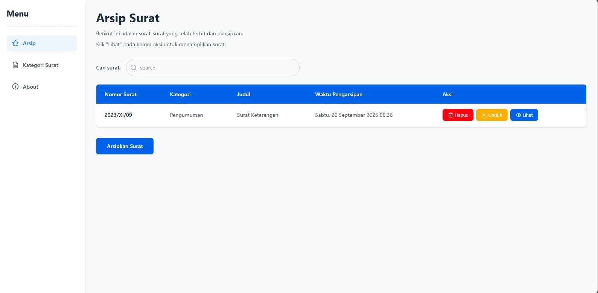
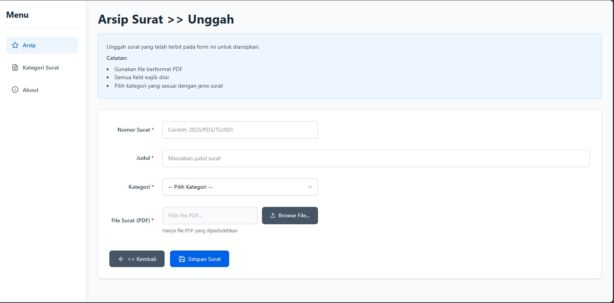
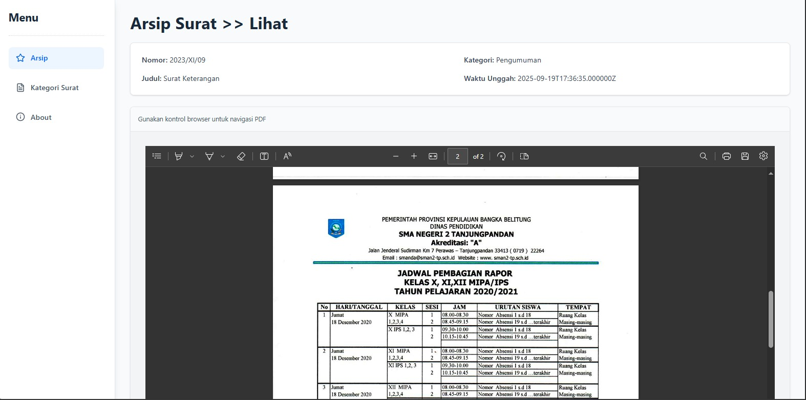
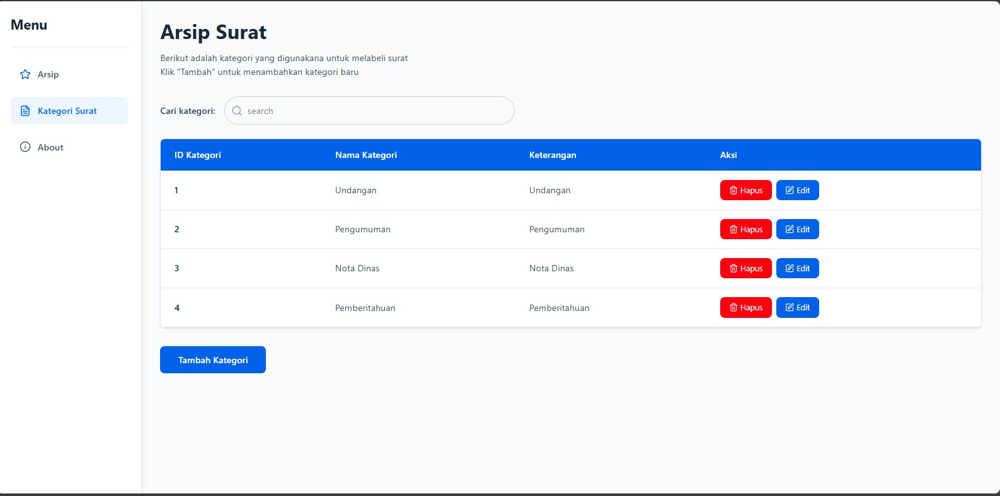
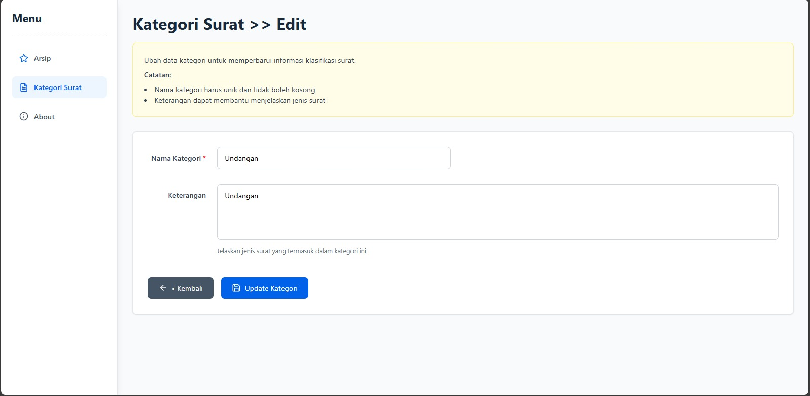
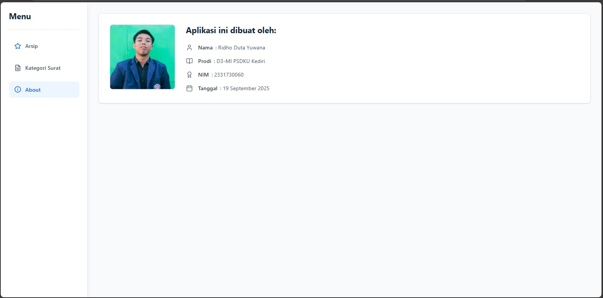

# ArsipPemerintah

ArsipPemerintah adalah sebuah aplikasi berbasis web yang dirancang khusus untuk membantu **Pemerintah Desa Karangduren** dalam mengelola dan mengarsipkan surat masuk maupun keluar secara digital. Aplikasi ini bertujuan untuk mempermudah proses pencarian, penyimpanan, dan pengelolaan dokumen surat agar lebih terorganisir dan efisien.

---

## Fitur Utama 🚀

* **Tambah Arsip Surat**: Pengguna dapat mengunggah dan menyimpan arsip surat baru dengan mudah.
* **Kategori Surat**: Arsip dapat dikategorikan berdasarkan jenisnya (misalnya, Surat Masuk, Surat Keluar, Surat Keputusan, dll.) untuk memudahkan navigasi.
* **Lihat Pratinjau PDF**: Aplikasi ini memungkinkan pengguna untuk melihat pratinjau file PDF secara langsung tanpa perlu mengunduhnya.
* **Unduh File**: Pengguna dapat mengunduh file arsip yang sudah tersimpan kapan saja.
* **Pencarian Cepat**: Fitur pencarian memungkinkan pengguna menemukan surat dengan cepat berdasarkan kata kunci, judul, atau kategori.

---

## Cara Menjalankan Aplikasi ⚙️

Ikuti langkah-langkah berikut untuk menjalankan aplikasi ArsipPemerintah di lingkungan lokal Anda:

1.  **Kloning Repositori**: Buka terminal atau Command Prompt dan jalankan perintah berikut untuk mengkloning repositori ini ke komputer Anda.
    ```bash
    git clone https://github.com/ridhoduta/arsip-pemerintah.git
    cd arsippemerintah
    ```

2.  **Impor Database**:
    * Pastikan Anda sudah memiliki server database (misalnya, MySQL atau MariaDB).
    * Buat database baru.
    * Impor file `arsip-pemerintah.sql` yang terletak di direktori proyek ke database yang telah Anda buat.

3.  **Konfigurasi `.env`**:
    * Salin file `.env.example` menjadi `.env`.
    * Sesuaikan konfigurasi database pada file `.env` dengan kredensial database Anda.

4.  **Jalankan Server**:
    * Jalankan server pengembangan Laravel dengan perintah:
    ```bash
    php artisan serve
    ```
    * Aplikasi akan dapat diakses di `http://127.0.0.1:8000` atau alamat yang ditampilkan di terminal.

---

## Tampilan Aplikasi 📸

Berikut adalah beberapa tangkapan layar dari aplikasi ArsipPemerintah untuk memberikan gambaran visual mengenai antarmuka pengguna dan fiturnya.


**Halaman Daftar Arsip**: Menampilkan semua arsip surat yang tersimpan dalam tabel yang rapi.


**Halaman Tambah Arsip**: Formulir untuk mengunggah dan menambahkan detail surat baru.


**Tampilan Pratinjau PDF**: Contoh pratinjau surat dalam format PDF.


**Tampilan Daftar Kategori**: Menampilkan semua kategori yang tersimpan.


**Tampilan Tambah Kategori**: Form untuk menambah kategori surat.


**Tampilan Edit Kategori**: Form untuk mengedit kategori surat.


**Tampilan About**: Menampilkan data tentang mahasiswa.



